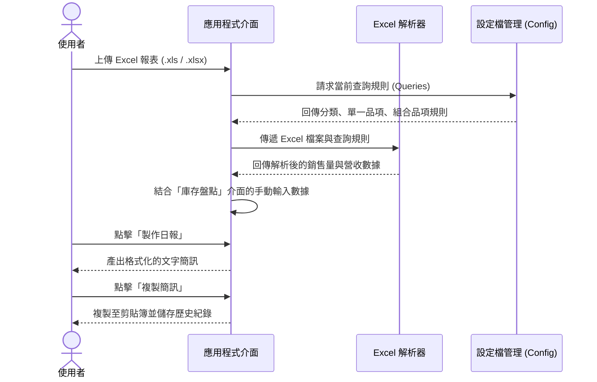
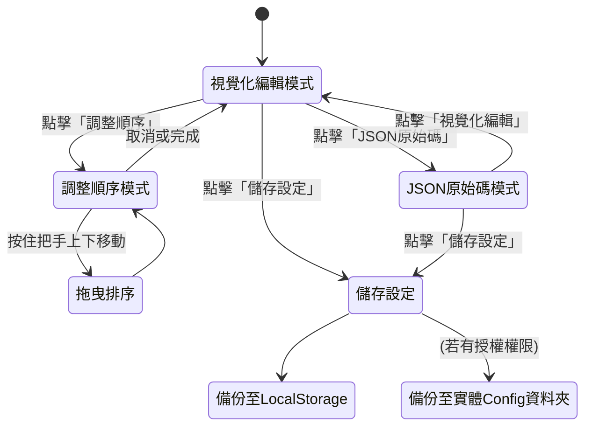
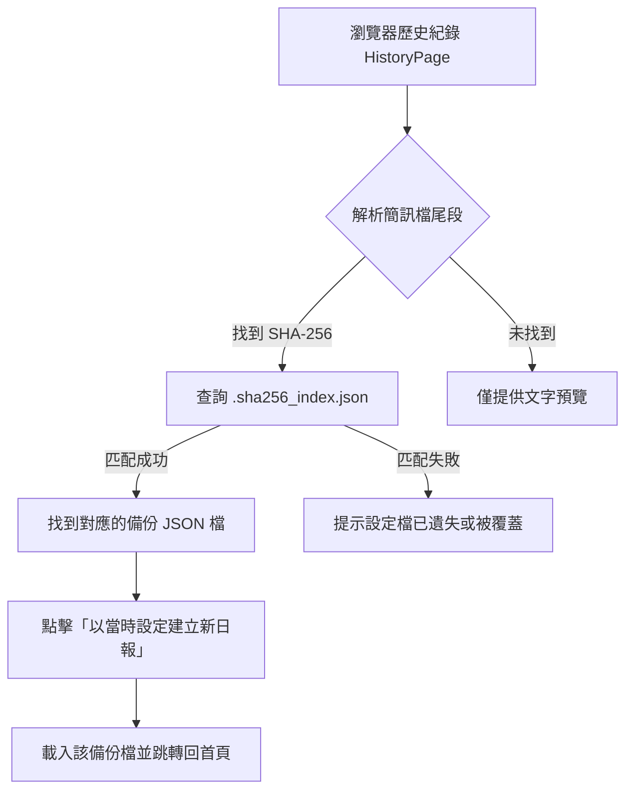

# 操作流程 (Operational Workflow)

本文件說明「85cc 營收回報小幫手」的主要操作流程，從使用者的角度出發，涵蓋了「設定管理」、「上傳與產出報告」以及「歷史紀錄與版本更新」的完整生命週期。

## 1. 核心操作流程 (Core Workflow)

應用程式的核心價值在於自動化讀取 Excel 報表並輸出文字簡訊。以下是主要的執行步驟：

## 2. 設定管理流程 (Settings Management)

使用者可以在「設定」頁面完全客製化查詢語法、新增刪除分類，甚至是重新排列順序。這一切的操作都會自動雙重備份（LocalStorage 與實體檔案）。

## 3. 歷史紀錄與重建流程 (History & Restoration)

每次成功產出簡訊時，系統會記錄下該文字檔，並在檔案末端附加上當前設定檔的 **SHA-256 雜湊碼**。未來如果需要回顧某天的紀錄，或用當時的設定檔重新製作日報，系統能夠精準找回對應的規則。

