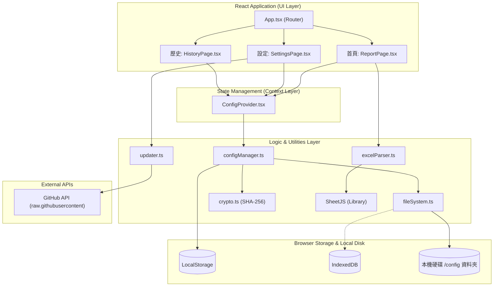

# 系統與架構層 (System & Architecture Layer)

本文件說明「85cc 營收回報小幫手」的整體系統架構、所使用的技術棧（Tech Stack），以及各核心模組之間的資料流動關係。

## 1. 系統技術棧 (Tech Stack)

- **前端框架**：React 19 + TypeScript
- **建置工具**：Vite 5
- **UI 圖示**：Lucide-React
- **資料解析**：XLSX (SheetJS) 用於解析 Excel 檔案
- **離線儲存機制**：
  - `LocalStorage`：儲存最新的設定檔 (Config)。
  - `IndexedDB` (via `idb`)：儲存 File System Directory Handle，讓使用者不需每次開啟網頁都重新選擇資料夾。
  - `File System Access API`：讓瀏覽器能夠直接讀取、寫入本地硬碟中的 `config/` 備份檔與歷史紀錄。

## 2. 整體架構圖 (Architecture Diagram)

系統架構採用前後端分離的概念，但因為這是一個純前端的在地應用程式（Local Web App），所謂的「後端」其實是由瀏覽器的原生儲存 API (File System, IndexedDB) 所取代。

## 3. 架構設計亮點

### 無伺服器且高隱私 (Serverless & Privacy-First)

- 所有的 Excel 報表解析 (`excelParser.ts`) 都在使用者的瀏覽器端完成，**不涉及任何伺服器上傳**，徹底保障營業資料的機密性。

### 雙重儲存機制 (Dual Storage Strategy)

- 為了確保資料不會因為清空瀏覽器快取而遺失，系統使用 `LocalStorage` 作為「最快讀取層」（Source of Truth for Fast Access），同時透過 `File System Access API` 將每一次的設定檔異動，實時寫入到本地硬碟的 `config/` 目錄中作為「持久備份層」。

### 目錄權限自動恢復 (Directory Handle Persistence)

- 瀏覽器基於安全性，原本每次重新整理都會失去對本地資料夾的存取權。
- 本系統架構中結合了 `IndexedDB`。當使用者授權資料夾後，系統會將 Directory Handle 存入 IndexedDB。下次載入時，只需透過 `verifyPermission()` 詢問一次存取權，不需重新開啟資料夾選擇視窗。
