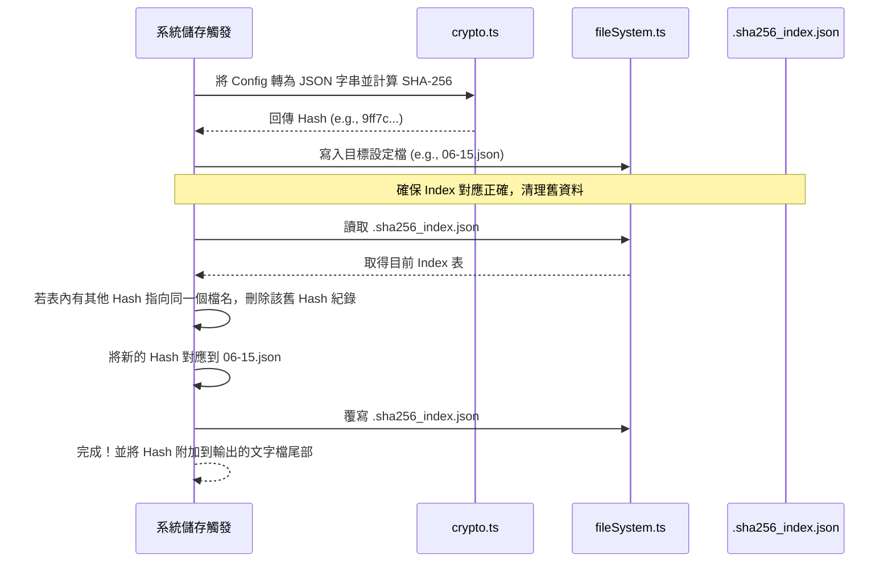
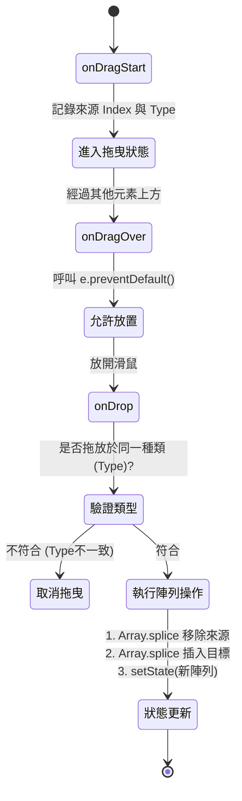

# 邏輯與函式層 (Logic & Function Layer)

本文件深入探討應用程式背後運作的核心演算法與函式邏輯，包含「Excel 動態查詢解析」、「設定檔雜湊對應（SHA-256 Mapping）」以及「原生拖曳重排（Drag-and-Drop）」等關鍵實作。

## 1. Excel 查詢解析邏輯 (`excelParser.ts`)

我們不依賴固定欄位，而是設計了一套迷你查詢語言（Query Syntax），讓使用者能自由組合算式。

- 符號對應：`>` (類別)、`~` (品項)
- 括號對應：`{}` (完全比對)、`[]` (包含比對)
- 結尾欄位：`:A` (數量)、`:B` (金額)

### 查詢解析流程

```mermaid
flowchart TD
    Start([輸入 Query 字串, e.g. ">[長條]:B + ~{咖啡}:A"]) --> ParseTokens[將字串切割成 Tokens]
    ParseTokens --> TokenLoop{走訪每個 Token}
    
    TokenLoop -->|Token = ">[長條]:B"| Extract1[萃取: 類型='>', 比對='[]', 目標='長條', 欄位='B']
    TokenLoop -->|Token = "+"| Op[記錄運算子為加號]
    TokenLoop -->|Token = "~{咖啡}:A"| Extract2[萃取: 類型='~', 比對='{}', 目標='咖啡', 欄位='A']
    
    Extract1 --> FindData[遍歷 Excel 每一列]
    Extract2 --> FindData
    
    FindData --> Match{是否符合比對條件?}
    Match -->|Yes| Accumulate[將對應欄位數值累加]
    Match -->|No| Skip[跳過該列]
    
    Accumulate --> Calc[根據運算子進行加減運算]
    Calc --> TokenLoop
    
    TokenLoop -->|沒有更多 Token| FinalResult([回傳最終計算數值])
```

## 2. SHA-256 備份追蹤機制 (`configManager.ts`)

為了讓歷史紀錄（簡訊文字檔）能回推當時使用的設定檔，系統實作了雜湊比對機制，避免檔名修改導致對應失效。

### 備份寫入與索引邏輯



## 3. 原生拖曳重排邏輯 (HTML5 Drag and Drop)

為求輕量化（不引入 dnd-kit 等大型第三方庫），在 `SettingsPage.tsx` 中直接使用 HTML5 原生 API 實作拖曳排序。

- **核心狀態：**
  - `isReorderMode`: 控制是否為拖曳狀態，開啟時將禁用所有 `<input>` 避免誤觸。
  - `draggingItem`: 記錄當前拖曳的陣列類型（如 `categories`）與索引。
  
### 事件處理機制



## 4. GitHub 版本更新檢測 (`updater.ts`)

系統無需透過 npm 或後端伺服器，直接存取 GitHub API 進行版本比對。

- 核心函式：`checkForUpdates()`
- 步驟：
  1. 向 `https://raw.githubusercontent.com/Stuus/85cc/main/report_app/package.json` 發送 HTTP GET 請求。
  2. 提取遠端 JSON 中的 `"version"` 欄位。
  3. 導入本地 `package.json` 的版本號，將兩者轉化為陣列（如 `[1, 0, 1]`）進行語意化（SemVer）比對。
  4. 若遠端數字較大，則觸發 UI 更新提示。
